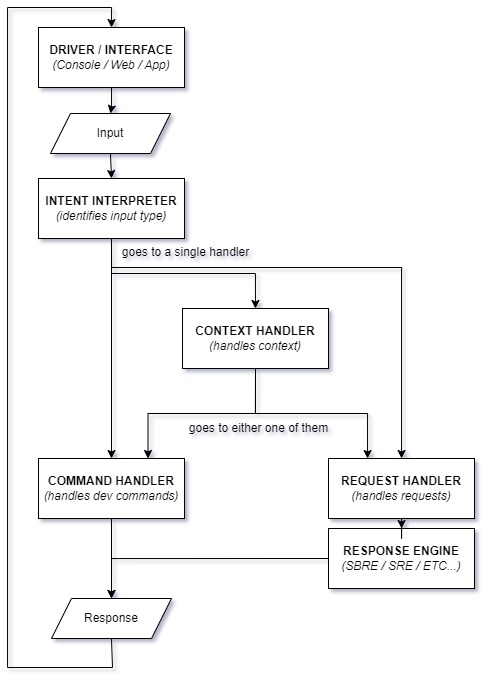

# F.R.I.D.A.Y | Desktop Virtual Assistant

      

---

An extremely versatile, modular, and sophisticated desktop virtual assistant written in pure Python. Uses a plugin architecture where pretty much every part of the assistant is an individual component that can be written in any way as long as it plugs into the core assistant. The name originates from the term "man/girl Friday", meaning go-to person and is heavily inspired by the [replacement virtual assistant](https://marvelcinematicuniverse.fandom.com/wiki/F.R.I.D.A.Y.) created by Tony Stark (Iron Man).

The primary response engine of Friday, SBRE implements python programs written in a specific format (inheriting from a Skill class) as "Skills" that it can perform based on command triggers from the user. A skill may be something as simple as telling the assistant to flip a coin to something complex as a password manager or an AI image enhancer. There are a few skills already defined:

| Skill | Description | Example |
| --- | --- | --- |
| Coin Toss | Toss a coin and get the outcome. | "Flip a coin" |
| Dice Roll | Roll a dice and get the outcome. | "Roll a dice" |
| Date/Time | Get information about date/time. | "What's the time?" |

## Flow



There are multiple components to what makes up the assistant, each of which can be extended or replaced.

### **Driver / Interface**

The interface available to the user as a software application that allows for communication with the assistant is the driver/interface. Almost any kind of user interface is supported as the assistant has a simple API which allows for easy setup of instances. The interface is also responsible for implementing additional non-core features like text-to-speech and speech-to-text, translations (will be built into the core in the future), accessibility and shortcuts, etc...

There is one functional interface available to the assistant, with additional interfaces being worked on.

- **Console Driver [Windows / Linux]**
    - A Command Line Interface (CLI) that uses an active command line to communicate with the assistant through text. Text-2-Speech and Voice Recognition are planned features.
- **Desktop Driver [Windows / Linux]** (Work In Progress)
    - A Graphical User Interface (GUI) written in Qt for Python that is similar to the Console Driver in terms of functionality but much more nicer looking and presentable.  
- **Web Driver [Windows / Linux / OSX / Android / iOS]** (Work In Progress)
    - A web interface in HTML, CSS, and JavaScript that runs an instance of the assistant on the cloud instead of the local machine, allowing for use on any platform. 

### **Intent Interpreter**

A component that is plugged into the assistant that attempts to understand and identify what kind of input was given to it by the driver/interface. It matches the input against the active input handlers and given to the handler that passes the check.

The benefit of having an intent interpreter is that user input can be intercepted and pre-processed or sent to various handlers before it is actually processed for an output.

#### **Input Handlers**

Input handlers are responsible for the actual processing done on the user input which is then given an output.

The primary handlers built-into Friday are:

- **Command Handler:** Handles slash-commands intended for debugging/development purposes. Commands may be defined and attached to the handler which is then attached to the input interpreter.
- **Response Handler:** Responsible for actual interactions done with the user such as listening to requests, providing assistance to the user, and doing all kinds of activities that the assistant can perform.
    - Response Handlers are further complicated with swappable **"Response Engines"** such as the **"Skill Based Response Engine (or SBRE)"** or the **"Simpleton Response Engine (or SRE)"**. *They will be further explained in detail below.*
- **Context Handler:** A special handler that has the privillege of taking priority over other handlers and redirecting inputs to any input handler it wishes. This handler helps the assistant stay realistic and keep track of chained-inputs that may be related to each other. For example a user may ask "Who is Alan Turing?" followed by "What was he known for?". The assistant won't understand the relation between the two inputs without the help of a context handler that can process them and hand them to the right part of the right handler.

Potential input handlers that can be added in the future:

- **Chat Handler:** An AIML or chatbot database assisted handler that can have meaningless but realistic conversations with the user like a chatbot.

- **Query Handler:** A separate handler to handle informational questions like "What is my name?" or "How old are you?" allowing for dynamically processed answers.

#### **Response Engines of Response Handlers**

There are two functional and stable response engines already available to the assistant.

- **Skill Based Response Engine (SBRE) *[default]***
    - Heavily modular and extendable response engine that depends on individual "skill files" for each ability of the assistant. Skill files are python files that inherit from the Skill class and plugs into the assistant to provide a certain functionality triggered by specified commands that match in the user input.
- **Simpleton Response Engine (SRE)**
    - Super simple response engine used mainly for demonstration and debugging purposes. Doesn't take advantage of modular skills functionality and instead opts for the old school long chain of if-else statements to check for specific content in user input to perform actions. 


---

### 🚀 Setup

Setting up Friday is quite simple, follow the instructions below:

1. [Clone the repository](https://docs.github.com/en/github/creating-cloning-and-archiving-repositories/cloning-a-repository-from-github/cloning-a-repository).

```sh
git clone https://github.com/waterrmalann/friday.git
```

2. Install the dependencies.

```sh
python -m pip install -r requirements.txt
```

3. Run the assistant within the terminal.

```sh
python "driver_console.py"
```

---

### 🤝 Contribution

Contributions are welcome and greatly appreciated! Feel free to open a pull request to fix any issues or to make improvements you think that should be made.
- **Contributions to the core.**
  - I believe the core is pretty stable as is but it could definitely be improved in many ways. You could fix anything that bugs you or even rewrite major parts of the assistant as long as they are an improvement in some way (performance, readability, consistency, etc..) and not a downgrade. If you're in doubt about whether the PR would be accepted or not, you can always open an issue to get my opinion on it.
- **Contributions to the response engines.**
    - You can choose to improve, or add more commands for the Simpleton Response Engine (SRE) or create skill files for the Skill Based Response Engine (SBRE) that inherits from the Skill class. 

License
----

This project is licensed under the **AGPLv3 License**, see [LICENSE](LICENSE).
